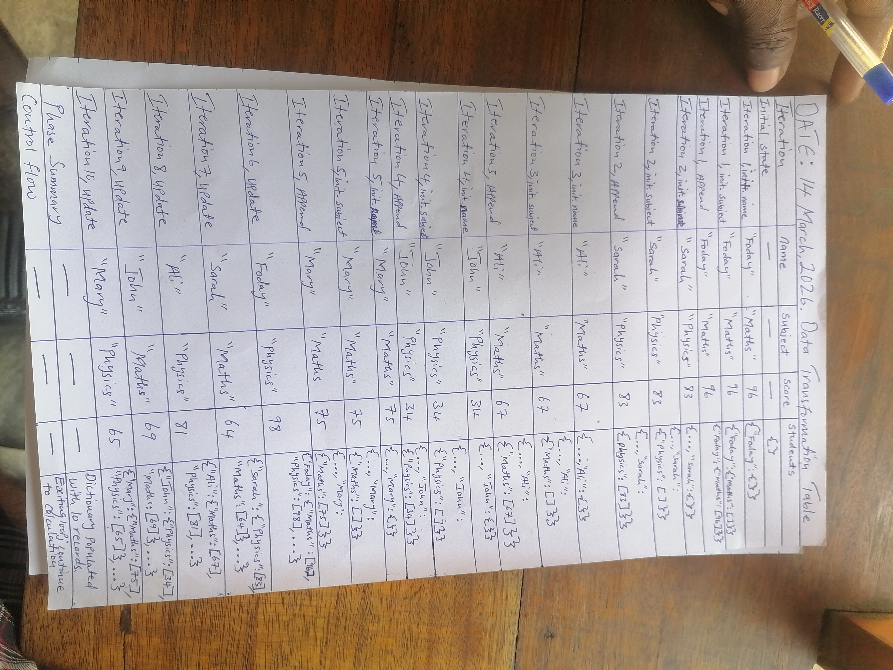

# Student Performance Aggregator

A robust Python utility designed for high-integrity processing of student performance data. This implementation emphasizes structured data management, defensive programming, and algorithmic transparency.

## Technical Implementation

* **Nested State Management**: Utilizes a dynamic dictionary-of-dictionaries structure to achieve O(n) grouping of multi-subject scores.
* **Defensive Aggregation**: Implements `setdefault()` for safe initialization and `try/except` blocks to mitigate `ZeroDivisionError` during average calculation.
* **Computational Accuracy**: Designed to process raw tuple streams into structured, human-readable performance metrics.

## Engineering Validation: Mechanical Execution Trace

To ensure computational accuracy, the system logic was subjected to a formal **Mechanical Execution Trace**. This "manual autopsy" of the data flow confirms that variable transitions and memory allocation function as intended across all test cases.

### 1. Data Transformation (Grouping Logic)
Maps raw record streams into organized subject-wise buckets.


### 2. Aggregation (Averaging Logic)
Verifies the accumulator state (`total_sum`, `total_count`) across iteration cycles.


## Execution Instructions

Ensure you are in the project root directory, then execute the following command:

```bash
python student_logic.py
